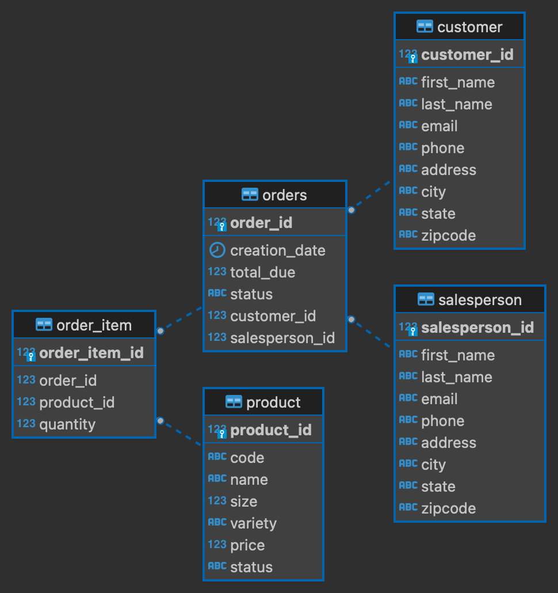

# Introduction
This app is the implementation of CRUD process for a database in a PSQL instance.
The implementation uses JDBC to connect to the database, customer DAO to handle CRUD process,
docker container to contain the PSQL instance.

# Implementaiton
## ER Diagram

## Design Patterns
- DAO is a class that CRUD the customer object and DTO is a customer in this project.
Using this design pattern gives us the ability to decouple business logic and database connection.
So the develop team can focus on what to do with DTO i.e. customer,
while DAO handles the CRUD interactions with database.
- A guarantee of atomicity prevents updates to the database occurring only partially,
which can cause greater problems than rejecting the whole series outright.
As a consequence, the transaction cannot be observed to be in progress by another database client.
For each transaction, if no exception occurs we commit it, otherwise we roll back the transaction.
Hence, at one moment in time, it has not yet happened, and at the next it has already fully occurred.

# Test
- Use bash script to set up the database by docker
- Use sql files to set up the tables in the database
- Run the CURD process using app and check the result by queries.
