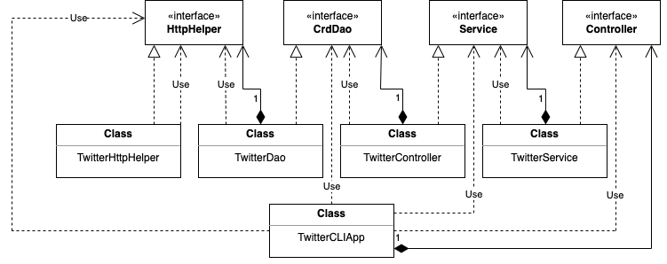

# Introduction
This Twitter App can create, read, delete tweets from CLI.
Create a tweet with a geotag and output the created tweet object (simplified version)
in JSON  format. Print error message (or exception) if tweet_text length is over 140
characters or coordinates is invalid (latitude or longitude is out of range).
Lookup a tweet by ID and print the tweet object in JSON format.
Print error message (or exception) if tweet_id is invalid.
Delete a list of tweets by id and output deleted tweet id and print deleted tweet object.

# Quick Start
- Package the project
```
mvn clean package
```
-Run the app with docker
```
docker pull limingy9/twitter_app
docker run --rm \
-e consumerKey=YOUR_VALUE \
-e consumerSecret=YOUR_VALUE \
-e accessToken=YOUR_VALUE \
-e tokenSecret=YOUR_VALUE \
limingy9/twitter_app "post" "tweet_text" "latitude:longitude"
```

# Design
## UML diagram


## Main
Declare and instantiate all components and call run method which calls controller
methods and print tweet(s).

## Controller Layer
This layer consumes user input (args in this app) and calls the corresponding service
layer method. It does not handle any business logic.

## Service
The service layer handled the business logic of the application.
In this app, although business logic is very simple, it usually very completed
(most codes are about business logic).

## DAO
```TwitterDao``` constructs Twitter REST API URIs and make HTTP calls using HttpHelper
```TwitterHttpHelper``` is only responsible for executing HTTP with a given URI.
In addition, it authorizes the HTTP request using Twitter secrets.

## Models
A simplified version of Tweet object, which only includes
- created_at (String)
- id (Long)
- id_str (String)
- text (String)
- entities (Entities)
- coordinates (Coordinates)
- retweet_count (Integer)
- favorite_count (Integer)
- favorited (Boolean)
- retweeted (Boolean)

## Spring
When I implement the interfaces, I pass the dependencies through constructors,
we can take advantage of this and eliminate all manual work by Spring framework.
- I use @Autowired annotation to tell IoC container to inject dependency through the constructor.
- And I use stereotypes of @component to tell IoC container this class is a Bean.
- @SpringBootApplication is used as a composition of multiple annotations which help to configure Spring automatically.

# Test with Junit
### Integration test
- Integration tests involve the tested classes and their dependencies.
### Unit test
- Mockito is used as a mocking framework that tests the only classes but not the dependencies.

# Deployment
- Create a twitter/Dockerfile
- Compile the code by mvn
- Build the image using docker.


# Improvements
- Find user id for user mention.
- Store secrets so no environment variables needed.
- Give a solution when trying to post identical tweets in a short interval.


